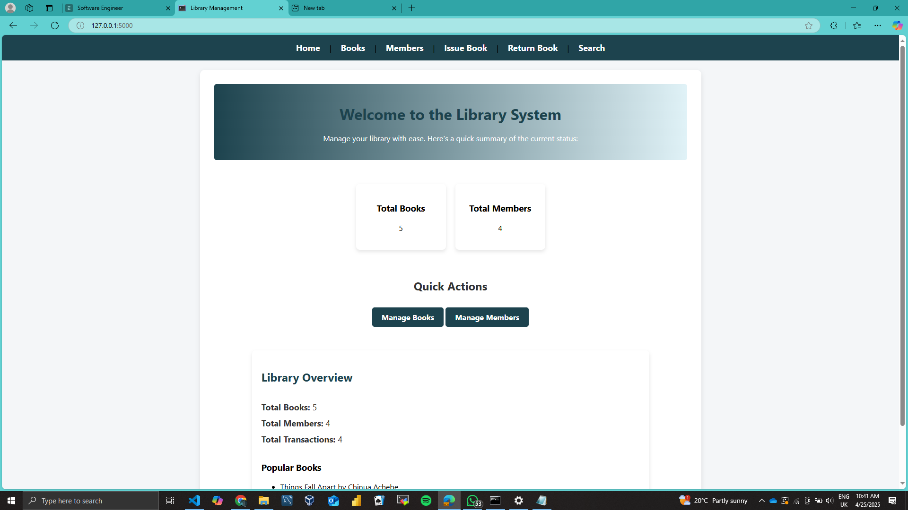
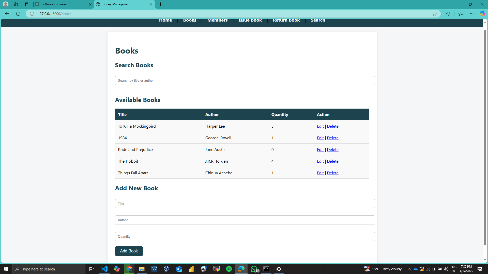
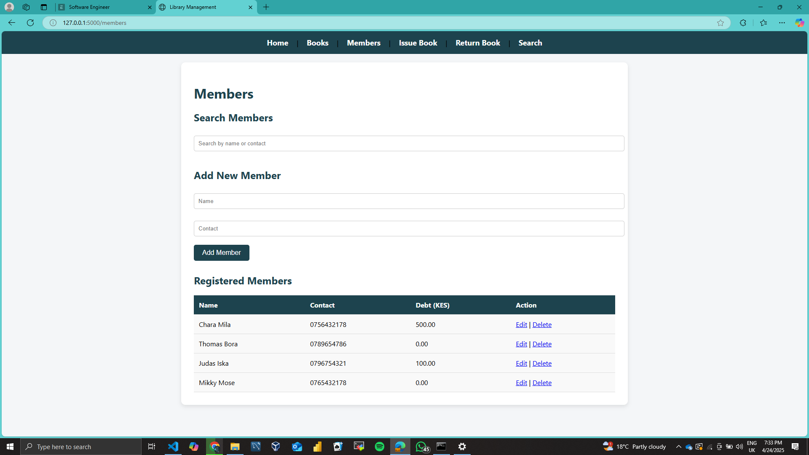
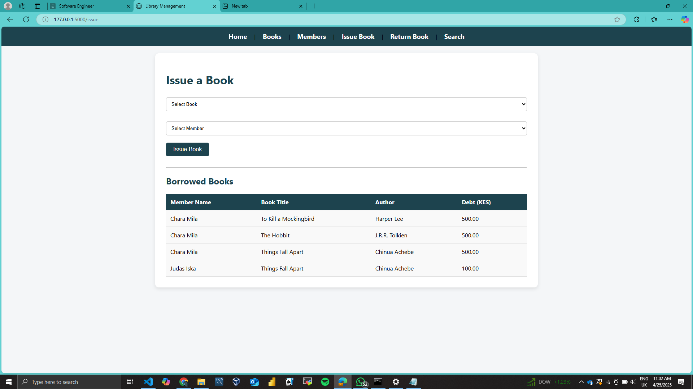

Library Management System
This is a simple Library Management System built with Flask, SQLAlchemy, and SQLite. It allows users to manage books, members, and transactions (book issue and return). Additionally, it displays the most popular books based on transaction history.

Features
Book Management: Add, edit, delete, and search books.

Member Management: Add, edit, delete, and search library members.

Transaction Management: Issue and return books, track due fees.

Popular Books: Display top 5 books based on the number of transactions.

Debt Limit: Members can only borrow books if their debt is under KES 500.

Rent Fee: Rent fee of KES 100 is added when a book is returned.

Requirements
Python 3.x
Flask
SQLAlchemy

Setup
1. Clone the repository:
git clone <repository_url>
cd <project_folder>

2. Create a virtual environment:

python -m venv venv
source venv/bin/activate  # On Windows use `venv\Scripts\activate`

3 .Install the required dependencies:
pip install -r requirements.txt

4. Set up the database:
This will automatically create the necessary tables in the SQLite database.
python
from app import db
db.create_all()

5.Run the application:
flask run
The application will be available at http://127.0.0.1:5000/

Endpoints
/ - Home page with an overview of books, members, and transactions.

/books - View, search, add, edit, or delete books.

/add_book - Add a new book.

/delete_book/<int:book_id> - Delete a book.

/members - View, search, add, edit, or delete members.

/add_member - Add a new member.

/delete_member/<int:member_id> - Delete a member.

/issue - Issue a book to a member.

/return - Return a book and update member debt.

/search - Search books by title or author.

/edit_member/<int:member_id> - Edit member details.

/edit_book/<int:book_id> - Edit book details.

Database Models
Book
id: Integer (Primary Key)

title: String (Book title)

author: String (Book author)

quantity: Integer (Quantity available)

Member
id: Integer (Primary Key)

name: String (Member name)

contact: String (Member contact details)

debt: Integer (Member debt)

Transaction
id: Integer (Primary Key)

book_id: Integer (Foreign Key to Book)

member_id: Integer (Foreign Key to Member)

date_issued: DateTime (Timestamp of when the book was issued)

date_returned: DateTime (Timestamp of when the book was returned, nullable)

Configuration
Configuration is handled through the Config class located in the config.py file. Make sure to set up your environment variables (e.g., for production or development).

Troubleshooting
Flask Debug Mode: If you encounter issues, ensure that the Flask app is running in debug mode (app.run(debug=True)) for detailed error messages.

Database Issues: If the database isn't updating, try dropping the tables and recreating them:
db.drop_all()
db.create_all()

Screenshots
 Homepage

Books Page

Members Page

Issue Book Page

Return Book Page

Contributing
We welcome contributions to this project. If you’d like to contribute, please follow these steps:

Fork the repository.

Create a new branch (git checkout -b feature-branch).

Commit your changes (git commit -am 'Add new feature').

Push to your branch (git push origin feature-branch).

Submit a pull request.

License
This project is licensed under the MIT License 

